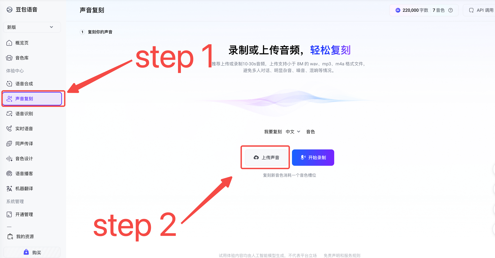
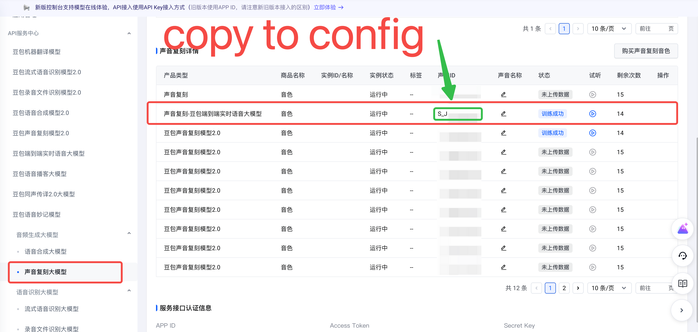

# redbook-pipeline

Automated paper introduction video generation pipeline. Input a research paper PDF, get a PPT presentation with AI-narrated video.

**输入**: 学术论文 PDF  
**处理**: AI 自动分析 → 结构化摘要 → 提取论文图片 → 生成 PPT 内容 + 旁白脚本 → TTS 语音合成 → 视频渲染  
**输出**: 带 AI 旁白的 PPT 讲解视频（MP4）

---

## 系统要求

- Python 3.11+
- macOS / Linux / Windows (WSL)
- LibreOffice (用于 PPT 渲染)

```bash
# macOS
brew install libreoffice poppler

# Ubuntu
sudo apt-get install libreoffice poppler-utils
```

---

## 安装

```bash
# 1. 进入项目目录
cd redbook-pipeline

# 2. 创建 conda 环境（推荐）
conda create -n literature-review python=3.12
conda activate literature-review

# 3. 安装依赖
pip install -e .
```

---

## 配置

### API Keys（`.env`）

复制示例文件并编辑 `.env` 填入真实 API Keys：

```bash
cp .env.example .env
```

`.env` 示例：

```bash
# LLM API (OpenAI-compatible endpoint)
LLM_API_KEY=your_llm_api_key
# LLM_BASE_URL=https://api.openai.com/v1
# LLM_MODEL=gpt-4o-mini

# Volcengine v3 TTS (标准内置音色)
VOLC_APPID=your_appid
VOLC_API_KEY=your_api_key

# Volcengine Voice Clone (大模型 — 可选，未开通则自动回退内置音色)
VOLC_CLONE_API_KEY=your_clone_api_key
VOLC_CLONE_SECRET=your_clone_secret

# 已克隆的说话人 ID（可选，若设置则跳过克隆直接使用）
VOLC_SPEAKER_ID=your_speaker_id
```

### 声音克隆（可选）

如需使用自定义音色，可通过字节火山引擎「声音复刻」平台上传/录制音频并获取说话人 ID，填入 `.env` 的 `VOLC_SPEAKER_ID`。

1. 进入 [火山引擎声音复刻](https://www.volcengine.com/product/seedvoice) 控制台，在左侧选择 **声音复刻**：
   

2. 点击 **上传声音**，按提示录制或上传一段清晰的样本音频。

3. 训练完成后，进入 **API 服务中心**，找到「声音复刻」模型，复制 **音色 ID/标签** 到 `.env` 的 `VOLC_SPEAKER_ID`：
   

4. 若不设置 `VOLC_SPEAKER_ID`，Pipeline 将自动使用火山引擎 v3 标准内置音色。

### 汇报人信息（`config/settings.yaml` 或 `.env`）

汇报人信息支持两种方式配置，**`.env` 优先级高于 `settings.yaml`**：

**方式一：配置文件（推荐）**

编辑 `config/settings.yaml`：

```yaml
presenter:
  name: "张三"        # 封面左侧显示为 "汇报人：张三"
  affiliation: "工程学科"  # 封面右侧显示
  date: "2025年6月"            # 封面下方居中显示，留空则不显示
```

**方式二：环境变量**

```bash
PRESENTER_NAME=张三
PRESENTER_AFFILIATION=工程学科
PRESENTER_DATE=2025年6月
```

---

## 使用方法

### 1. 全链路执行

```bash
redbook run paper.pdf
```

完整流程：PDF 解析 → LLM 分析 → 内容生成 → 图片提取 → PPT 填充 → 声音克隆 → TTS 合成 → 视频渲染

### 2. 断点续跑

```bash
# 查看 Job 状态
redbook status <job_id>

# 从指定步骤恢复
redbook resume <job_id> --from tts_synthesizer
```

### 3. 单步调试

```bash
# 只运行某一步
redbook run paper.pdf --only ppt_builder --force
```

### 4. 查看所有 Job

```bash
redbook list-jobs
```

---

## Pipeline 流程

```
Step 0: 初始化 (Job ID + 输出目录)
    ↓
Step 1: PDF 解析 ──────→ 01_raw_text.json + images/
    ↓
Step 2: LLM 论文分析 ──→ 02_paper_structure.json (Kimi)
    ↓
Step 3: LLM 幻灯片生成 → 03_slide_content.json (Kimi，自动选配图片)
    ↓
    ├───────────────────────┐
    │                       │
Step 4: PPT 填充          Step 5: TTS 合成（火山引擎 v3）
    ↓                       ↓
06_output.pptx        05_audio/slide_*.mp3
    ↓
Step 6: PPT 渲染 ──────→ 07_frames/slide_*.png (LibreOffice)
    ↓
Step 7: 视频合成 ──────→ 08_final.mp4 ★
```

---

## PPT 模版结构

模版共 16 页，根据内容量**动态决定**实际使用页数，多余页面自动删除：

| 页码 | 类型 | 内容 |
|------|------|------|
| 1 | 封面 | 中英文标题 + 汇报人（左）+ 院系（右）+ 日期（下） |
| 2 | 目录 | 分享内容概览 |
| 3 | 文献介绍 | 期刊、分区、影响因子、作者 |
| 4 | 研究背景 | 领域背景知识 |
| 5 | 研究目的 | 核心问题 |
| 6-9 | 文章结果 | 实验结果 + 配图（最多4页，动态） |
| 10-13 | 研究方法 | 方法要点 + 配图（最多4页，动态） |
| 14-15 | 讨论 | 意义、局限、方向（最多2页，动态） |
| 16 | 结束页 | 感谢聆听 |

### 内容页布局（左右分栏）

内容页（研究背景、研究目的、文章结果、研究方法、讨论）采用**左右分栏**布局：

- **左侧（60%）**：bullet points 文字内容，**居中对齐**
- **右侧（40%）**：LLM 自动从论文 PDF 中提取并选配的相关图片（实验结果图、模型架构图等）
- 图片下方可选显示 caption 标注

---

## 图片提取与配图

Pipeline 在 PDF 解析阶段自动从论文中提取图片，过滤掉图标、装饰性元素等无效图片，仅保留真实的内容图片。

LLM 在生成 slide 内容时会自动判断哪些 slide 适合配图，并选择合适的图片：

- `results` 类型：优先选实验结果图、对比图表
- `methods` 类型：优先选模型架构图、流程图
- `background` 类型：可选领域示意图

图片保存在 `outputs/{job_id}/images/` 目录下。

---

## 项目结构

```
redbook-pipeline/
├── config/
│   ├── settings.yaml           # 主配置（汇报人信息、参数等）
│   └── prompts/                # LLM Prompt 模版
│       ├── paper_analysis.md
│       └── slide_generation.md
├── pptx_template/
│   └── 模板.pptx               # PPT 模版（可替换）
├── source_voice/
│   └── source.mp3              # 声音克隆样本（可选）
├── src/redbook_pipeline/
│   ├── cli.py                  # CLI 入口
│   ├── pipeline.py             # 全链路编排器
│   ├── config.py               # 配置加载（.env + yaml）
│   ├── models/                 # Pydantic 数据模型
│   │   ├── paper.py            # 论文相关模型（含 ExtractedImage）
│   │   └── slide.py            # Slide 内容模型（含 image_path）
│   ├── skills/                 # 各步骤独立 Skill
│   │   ├── base.py             # 断点续跑基类
│   │   ├── s01_pdf_parser.py   # PDF 解析 + 图片提取
│   │   ├── s02_paper_analyzer.py
│   │   ├── s03_slide_generator.py  # LLM 内容生成 + 自动配图
│   │   ├── s04_ppt_builder.py      # PPT 填充（左右分栏）
│   │   ├── s05_voice_clone.py
│   │   ├── s05b_tts_synthesizer.py
│   │   ├── s06_ppt_renderer.py
│   │   └── s07_video_composer.py
│   └── utils/
│       ├── volcengine_tts.py   # 火山引擎 TTS 客户端
│       └── libreoffice.py      # LibreOffice 渲染封装
├── outputs/                    # 运行时产物（git ignore）
│   └── {job_id}/
│       ├── 01_raw_text.json
│       ├── 02_paper_structure.json
│       ├── 03_slide_content.json
│       ├── 04_voice_clone_result.json
│       ├── 05_audio/
│       ├── 06_output.pptx
│       ├── 07_frames/
│       ├── 08_final.mp4
│       └── images/             # 从 PDF 提取的图片
├── logs/                       # 运行日志
└── PRD.md                      # 产品需求文档
```

---

## 技术栈

| 模块 | 技术 |
|------|------|
| PDF 解析 | PyMuPDF（文本 + 图片提取） |
| LLM | OpenAI-compatible API (e.g., GPT-4o / DeepSeek / Kimi) |
| PPT 操作 | python-pptx |
| TTS | 火山引擎 v3 TTS |
| PPT 渲染 | LibreOffice + pdf2image |
| 视频合成 | moviepy |
| CLI | Typer + Rich |

---

## 开发状态

| 模块 | 状态 | 备注 |
|------|------|------|
| PDF 解析 | ✅ 完成 | 文本提取 + 图片提取 |
| LLM 论文分析 | ✅ 完成 | OpenAI-compatible API 调用正常 |
| LLM 幻灯片生成 | ✅ 完成 | 口语化旁白 + 自动配图 |
| PPT 模版填充 | ✅ 完成 | 左右分栏 + 居中文字 + 图片 |
| TTS 合成 (v3) | ✅ 完成 | 内置音色合成正常 |
| PPT 渲染 | ✅ 完成 | LibreOffice 渲染正常 |
| 视频合成 | ✅ 完成 | moviepy 合成正常 |
| CLI | ✅ 完成 | run/resume/status/list-jobs |
| 声音克隆 | ⚠️ 可选 | 未开通时自动回退内置音色 |
| MaaS 大模型 TTS | 🔜 待接入 | 需 endpoint_id |

---

## 测试验证

端到端测试：

```bash
redbook run tests/fixtures/test_paper.pdf --job-id test_e2e
# 输出: outputs/test_e2e/08_final.mp4
```

各步骤执行时间参考：
- PDF 解析（含图片提取）: ~1-2s
- LLM 论文分析: ~6s
- LLM 幻灯片生成: ~22s
- PPT 填充: <1s
- TTS 合成: ~30s
- PPT 渲染: ~3s
- 视频合成: ~2min

---

## License

MIT
